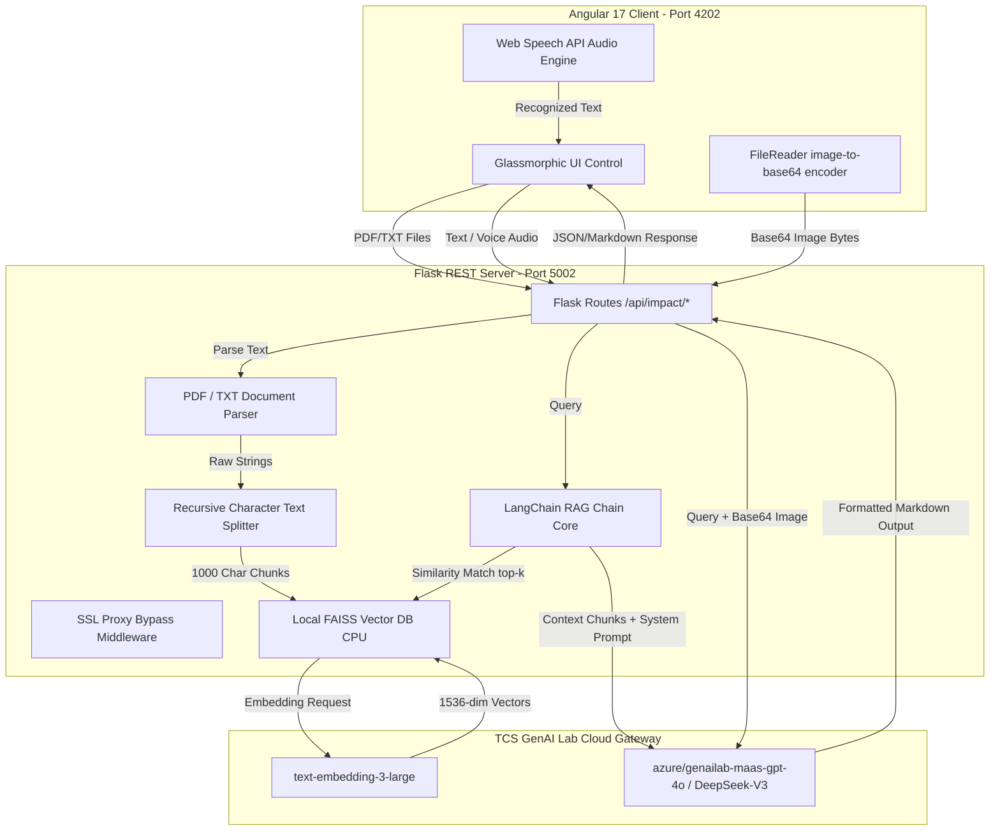
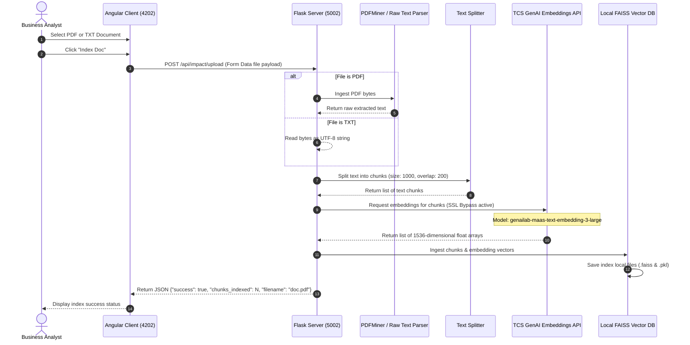
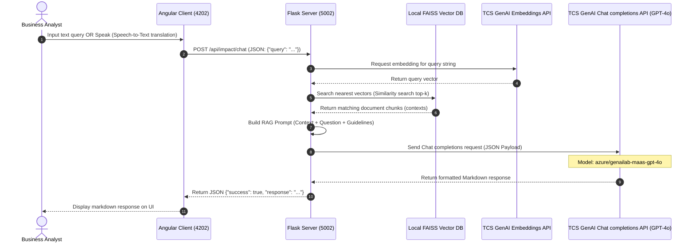
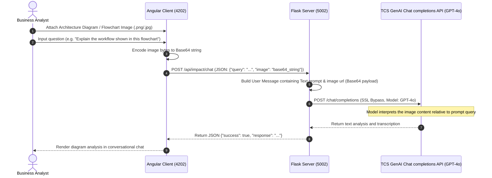

# System Architecture: GenAI-Powered Document RAG & Vision Assistant
This document models the data routing, service integrations, and core workflows of the solution.

---

## 🏗️ 1. Overall System Architecture
The solution consists of a decoupled Client-Server architecture designed to run locally, connecting securely to the remote TCS GenAI Lab API gateway.

---

## 📥 2. Data Ingestion Flow (indexing documents)
This sequence handles text extraction, chunking, embedding generation, and indexing in the local database.

---

## 🔍 3. Retrieval & RAG Query Flow
This sequence maps out semantic query retrieval, prompt synthesis, and language model inference.

---

## 📷 4. Vision OCR & Multi-Modal Chat Flow
This flow describes how visual files (diagram flowcharts, UI mockups, scan sheets) are processed directly by the multimodal LLM to extract visual logic.

