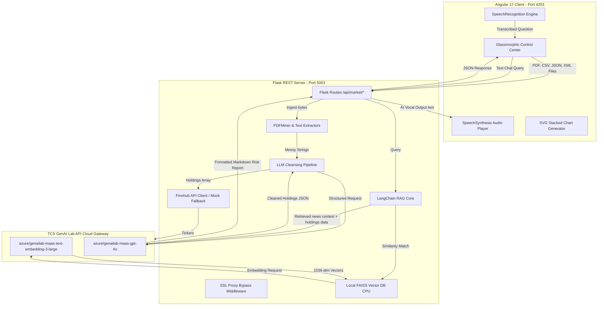
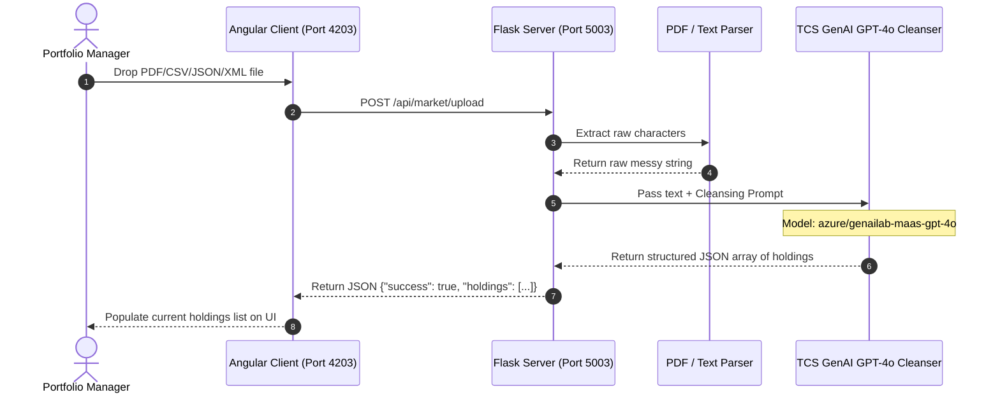
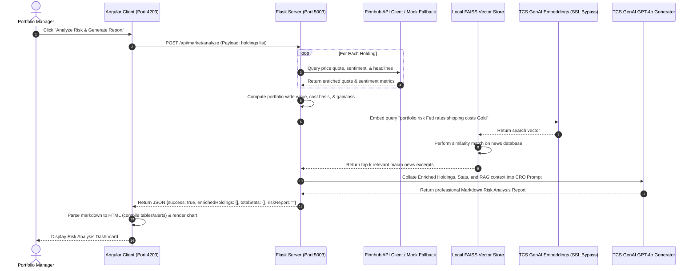
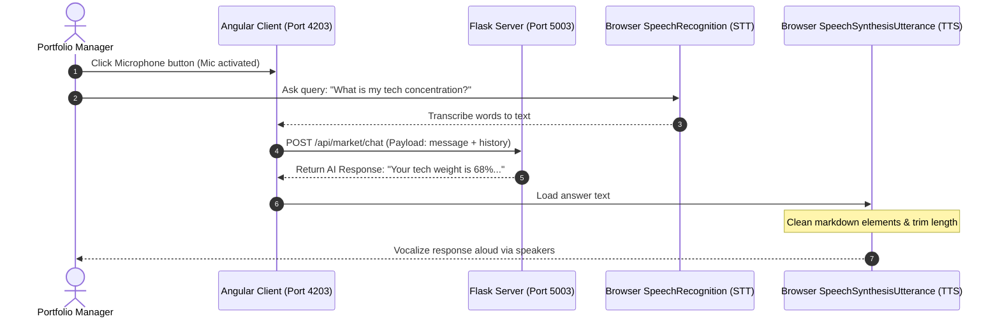
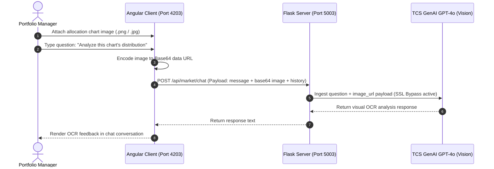

# System Architecture: Capital Markets Portfolio Risk Summarizer

This document maps out the component layout, data flow sequences, and RAG/Vision pipelines powering the Capital Markets Portfolio Risk Summarizer.

---

## 🏗️ 1. Overall System Architecture

The application is built on a decoupled **Client-Server architecture**. The Angular client handles user interactions, charts calculation, and browser Web Speech streams, while the Flask backend handles files parsing, LLM calls, RAG search, and live Finnhub lookups.

---

## 📥 2. Ingestion & Holdings Cleansing Sequence

When a portfolio file is dropped, the system parses the raw format and sends it to the LLM to get uniform JSON elements:

---

## 📈 3. Live Data Enrichment & Stress Testing Flow

Once holdings are parsed, the system queries market indicators and retrieves RAG macroeconomic news to generate the stress-tested Risk Report:

---

## 🎙️ 4. Voice-Enabled Assistant Loop (STT / TTS)

This flow utilizes native HTML5 Web Speech APIs to support voice operations:

---

## 📷 5. Multi-Modal Vision / OCR Query Loop

Users can capture an allocation chart and ask questions directly:

