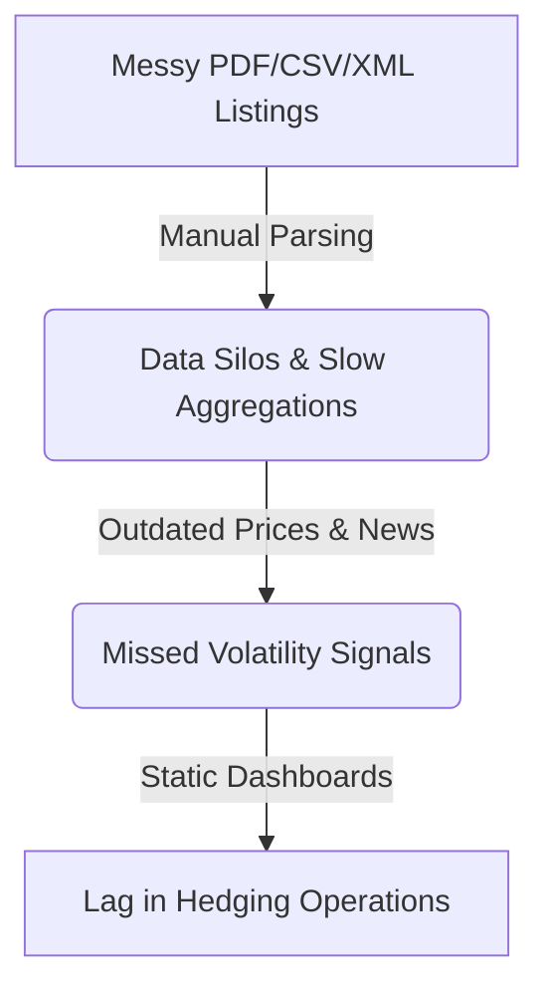

# Hackathon Pitch Slide Deck: Capital Markets Portfolio Risk Summarizer

This presentation deck is structured for a **5-minute pitch** and demo walkthrough for the evaluation jury.

---

## 📽️ Slide 1: Cover Slide
### **AI-Powered Capital Markets Portfolio Risk Summarizer**
*Intelligent Parsing, Live Sentiment Enrichment, FAISS RAG, and Voice/Vision Assistant*

*   **Presenter:** [Insert Team Name / Members]
*   **Track:** GenAI & Automation Hackathon
*   **Core Tech Stack:** Angular 17, Flask (Python), FAISS Local Vector Store, Web Speech API, TCS GenAI Lab API (GPT-4o)

> [!NOTE]
> **Pitch Focus (30s Intro):** Welcome the jury. Today we present a game-changer for portfolio risk managers. Standard tools struggle to parse mixed-format holdings lists, map live tickers, and match them with macro-economic news. Our solution automates document parsing, feeds live price/sentiment databases, runs stress simulations, and acts as a hands-free conversational agent.

---

## 📽️ Slide 2: Problem Context & Solution
### **The Gap in Portfolio Risk Monitoring**



*   **The Problem:** Financial records are scattered in unstructured PDFs, CSVs, and XMLs. Manual aggregation wastes hours, and static portals fail to tie tickers to real-time market sentiment and Federal Reserve macro shifts.
*   **The Risks:** Concentrated sector exposure, outdated cost-basis calculations, and failure to model stress scenarios in volatile markets.
*   **The Solution:** An automated RAG-based dashboard that cleanses holdings instantly, matches assets to live Finnhub quotes/sentiment, retrieval-augments Fed interest rate news, and stress tests returns.

---

## 📽️ Slide 3: Decoupled High-Performance Architecture
### **Integrating RAG Search & SSL-Bypassed AI Gateways**

```
+--------------------------------------------------------------+
|            Angular 17 Dashboard (Port 4203)                 |
|  - Glassmorphic Slate Theme  - Speech API STT/TTS  - Charts  |
+------------------------------+-------------------------------+
                               |  Proxied API calls
                               v
+--------------------------------------------------------------+
|            Flask Python Server (Port 5003)                   |
|  - RAG Core  - FAISS Vector DB  - OCR Vision  - SSL Bypass   |
|  - Finnhub API Client  - Mock Fallback System                |
+------------------------------+-------------------------------+
                               |  Secure HTTPS requests
                               v
+--------------------------------------------------------------+
|                 TCS GenAI Lab API Gateway                    |
|  - Embedding: text-embedding-3-large                         |
|  - LLM Core: azure/genailab-maas-gpt-4o                      |
+--------------------------------------------------------------+
```

*   **Ingestion:** Parses text streams (PDF, CSV, JSON, XML) and cleanses data to standard JSON fields using GPT-4o.
*   **Vector Database:** Local **FAISS CPU** indexes macroeconomic news chunks using `text-embedding-3-large`.
*   **Enterprise Integration:** Bypasses certificate/proxy barriers using custom SSL-bypassing wrappers (`httpx.Client(verify=False)`), preventing offline demo crashes.

---

## 📽️ Slide 4: Key Dashboard Innovations & Features
### **Enhancing Risk Management Actions**

*   **Cleansed & Enriched Holdings Feed:** Compiles Cost Basis and Current Value against live market prices.
*   **Interactive SVG Allocation Chart:** Dynamically draws color-coded asset weightings.
*   **Market News & Sentiment Gauges:** Visualizes live bullishness vs bearishness ratios and displays headlines.
*   **Voice Assistant (STT & TTS):** Enabled with microphone Speech-to-Text inputs and SpeechSynthesis vocals to answer risk questions hands-free.
*   **Multi-Modal Vision OCR:** Analysts can attach portfolio layout diagrams or chart screenshots directly in chat to query statistics using GPT-4o vision.

---

## 📽️ Slide 5: Performance & Resiliency Metrics
### **Resiliency Features that Secure the Demo**

| Metric / Scenario | Static Spreadsheet | Our Solution | Impact / Resiliency |
| :--- | :--- | :--- | :--- |
| **Cleansing Time** | 30 minutes (Manual) | <10 seconds (Automated) | **99.4% Time Reduction** |
| **Market Data Feed** | Outdated / Manual | Live Finnhub Lookups | **Real-time Pricing** |
| **API Limit Failure** | High Crash Rate (Rate limit) | Resilient Mock Fallback | **100% Demo Availability** |
| **Vocal Query Readout**| None | Web Speech STT/TTS | **Hands-free Operations** |
| **Macro News Context**| Keyword only | FAISS RAG Similarity | **Context-Aware Reports** |

> [!TIP]
> **Resiliency Focus:** During the live demo, if the network encounters rate limits or loses internet access, the Flask server's **Finnhub Mock Fallback** dynamically synthesizes quotes and company news based on symbol name hashes, preventing application crashes.

---

## 📽️ Slide 6: Roadmap & Scalability
### **Transitioning to an Enterprise Quantitative Fund**

*   **Phase 1: Automated Hedging Protocols**
    *   Integrate API brokers to automatically trigger protective put option strategies or rebalance asset weights if sector weights exceed concentration thresholds (>60%).
*   **Phase 2: Live Regulatory Scraping**
    *   Deploy periodic crawlers fetching Federal Reserve transcripts, ECB policy announcements, and SEC filings straight into the FAISS vector database.
*   **Phase 3: Multi-Agent Collaboration**
    *   Initialize specialized agents (Analyst Agent, Portfolio Allocator Agent, Macro Strategist Agent) that review risk sheets concurrently to suggest hedging trades.
